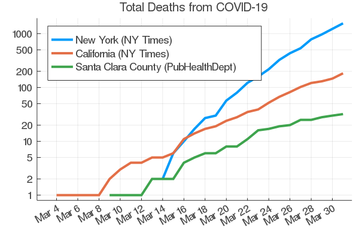

# COVID-19 deaths in Santa Clara County, SF Bay Area, and California

A plot of deaths due to COVID-19 in Santa Clara County, for the San
Francisco Bay area, and in California is shown below. The data for
Santa Clara County is taken from the
[county public health department](https://www.sccgov.org/sites/phd/DiseaseInformation/novel-coronavirus/Pages/dashboard.aspx)
while the data for the nine counties in the SF Bay area are taken from
the NY Times [github repo](https://github.com/nytimes/covid-19-data)
of COVID-19 data. 

The most hopeful sign to me is that the slope of the death curve for
the past few days for the county is not as steep as it was previously,
and is less steep than for the Bay area or California. The Santa Clara
Public Health department was a leader by [reccommending on March 5](https://www.sccgov.org/sites/phd/news/Pages/new-guidance-new-covid-19-3-5-2020.aspx) that
employers suspend non-essential travel and obey social distancing,
on March 13
[prohibiting](https://www.sccgov.org/sites/phd/news/Pages/press-release-03-13-20.aspx)
gatherings of more than 100 people, and finally on March 16 leading
the effort in which all Bay area counties announced a
[shelter-in-place](https://www.sccgov.org/sites/phd/news/Pages/press-release-03-16-20.aspx)
order. For comparison, California put a similar shelter-in-place order
in effect several days later
[March 19](https://www.cdph.ca.gov/Programs/CID/DCDC/CDPH%20Document%20Library/COVID-19/Health%20Order%203.19.2020.pdf). My
interpretation of the shape of the curves is that Santa Clara County's
actions are having the desired effect, and we are seeing less deaths
as a result. I hope that the rest of the Bay area, California, and the
country follow suit.
