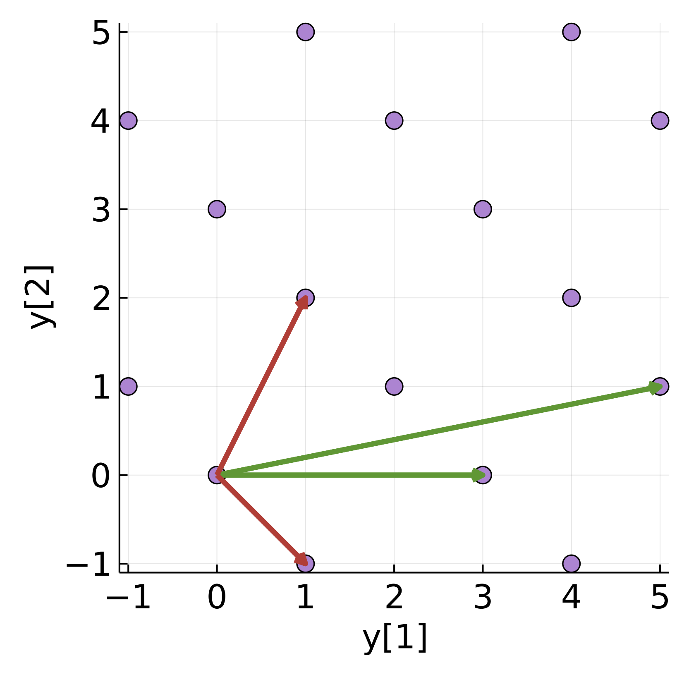

# What is Lattice Cryptography?

Cryptography is based on problems that are hard to solve in general, but easy to solve with additional information. One such problem is the difficulty of factoring the product of two large prime numbers. In this case the additional information is one of the prime numbers. For the large numbers used in cryptography today, someone who does not have either of the prime factors can not find them, even with very powerful computers. Systems such as [RSA](https://en.wikipedia.org/wiki/RSA_(cryptosystem)) which are based on prime factorization are considered secure, though [attacks](https://link.springer.com/content/pdf/10.1007/3-540-68697-5_11.pdf) using lattice reduction have been found when library designers or users do [something stupid](https://link.springer.com/content/pdf/10.1007/3-540-68697-5_11.pdf) and reveal too much information.

<!---
Prime-based crypto
- Successful for classic computers
- BAsis of all cryptography today
- Quantum attacks 
  - Amazing
  - Still not obvious if or when they will succeed
- best attacks with classic computers often use lattice tools
--->

Another early [cryptosystem](https://en.wikipedia.org/wiki/Merkle%E2%80%93Hellman_knapsack_cryptosystem) was based on the [subset-sum](https://en.wikipedia.org/wiki/Knapsack_problem) (or knapsack) problem which was believed to be hard to solve unless one has side information (a permutation that makes the subset superincreasing). Unfortunately attacks were quickly found, including one using [lattice reduction](https://dl.acm.org/doi/10.1145/2455.2461); these attacks make this system insecure.

Even though cryptography based on the hardness of finding prime factors is secure against current powerful computers, in 1994 it was found that if a powerful quantum computer could be built, it could [easily find](https://en.wikipedia.org/wiki/Shor's_algorithm) these factors and also break cryptography based on [elliptic curves](https://en.wikipedia.org/wiki/Elliptic-curve_cryptography). After this quantum attack was found, a search began for problems that are hard even for quantum computers. Some researchers looked for lattices which are  [hard](https://en.wikipedia.org/wiki/Lattice_problem) to do lattice reduction on in both classic and quantum computers. These efforts resulted in a [lattice-based standard](https://en.wikipedia.org/wiki/Kyber) being chosen in the [final round](https://en.wikipedia.org/wiki/NIST_Post-Quantum_Cryptography_Standardization#Selected_Algorithms_2022) of NIST's search for a cryptographic standard that is believed to be secure against attack from attack from future powerful quantum (and classic) computers. 

It's clear that lattice reduction is a power full tool, but what is it?  Intuitively, a lattice is a regular set of points, such as the purple points in the figure above. A lattice is generated using a basis; the green arrows in the figure represent one basis for the purple lattice. Each purple point can be found by adding some integer combination of the green arrows.  Every lattice can be generated by many bases; in the figure the red arrows illustrate another basis for the  lattice.  Lattice reduction is the process of taking a given lattice basis (such as that represented by the green arrows), and finding a basis with components that are shorter and closer to orthogonal (such as the red basis). Lattice cryptographers represent a basis with a basis matrix, such as in the following matrices for the green and red bases in the figure:

$$B_{green} = \left[ \begin{array}{rr}
                      5  &  3 \\
                      1  &  0   
                 \end{array}\right] \\;, \\;\\;\\;\\;\\;
 B_{red} = \left[ \begin{array}{rr}
                      1  &  1 \\
                      -1  &  2   
                 \end{array}\right] \\;. $$

Lattice reduction looked pretty easy for the green and red bases above; what makes a basis hard for a powerful computer to do lattice reduction on? One thing is using much higher dimensional bases than the two-dimensional examples shown so far, say one hundred dimensions or more; another thing that makes a basis hard to reduce is using basis elements of much higher bit depth, for example sixty-four bits or more.  The basis matrix below has more dimensions (four) than our previous examples, and also has elements of much higher bit depth than previous.  Even though this matrix is not at all easy for a human to visualize in the same way as the two-dimensional problem in the figure above, it easy for a not-so-powerful computer to reduce. For problems that are hard (hopefully impossible!) for a powerful classic or quantum computer to reduce the number of dimensions must be increased; see [latticechallenge.org/](https://www.latticechallenge.org/) for examples of harder problems.

$$B = \left[ \begin{array}{rrrr}
       6714169179285760250 & 3904382587709331766 & 1484928972011185279 &  158973427218251831 \\
        222240594969818910 & 1865961114972015885 & 6291396082712905859 & 9157617360419036595 \\
        878128680551912807 & 3247508428419359782 & 6192395433663333636 & 4340458729683974548 \\
        933087331389830545 & 3249492973442901692 &  359041762650321617 & 4539344643683695950
      \end{array}\right]$$

As well as being used for post-quantum cryptosystems, lattice cryptography provides the only known constructions for fully homomorphic encryption, and functional encryption.  These are certainly decentralizing technologies in the sense of separating encryption and computation, while preserving privacy. These applications of lattice cryptography are not nearly as developed and widely accepted as (for example) [Kyber](https://en.wikipedia.org/wiki/Kyber) protocol for post-quantum public-key encryption. 

Further reading
* "[A Decade of Lattice Cryptography](https://eprint.iacr.org/2015/939)" by Chris Peikert is a mathematical introduction to the SIS and LWE problems, which are at the core of lattice cryptography.
* [fplll](https://github.com/fplll/fplll) is a C++ library implementing several powerful lattice algorithms written by academic cryptanalysts. 
* For material that is somewhat introductory, see the videos from "[Lattices: Algorithms, Complexity, and Cryptography Boot Camp](https://www.youtube.com/playlist?list=PLgKuh-lKre10rqiTYqJi6P4UlBRMQtPn0)" from the Simons Institute.

<!---
Blockchains that use lattice cryptography or any of the fancy tools listed above do not yet (in early 2023) appear to be an active area of research for academic cryptographers.
--->

<!---
 A mathematician would say a lattice is a full-rank discrete additive subgroup of (say) $\mathbb{R}^n$.  A (slightly) less mathematical definition says that given a basis matrix $B$, and a vector of integers $\mathbf{z}$, the set of points $\mathbf{y}$ reachable by $\mathbf{y} = B \mathbf{z}$ is a lattice: $\mathcal{L}(B) = \left\\{ B \mathbf{z}:\mathbf{z} \in \mathbb{Z}^n \right\\} $.   Given the matrix $B_{green}$ below, the purple points in the figure below illustrate the lattice $\mathcal{L}(B_{green})$; the columns of the matrix are illustrated with green arrows.
 
 To better understand what is going on, look at the purple point at $y[1]=2$, $y[2]=1$. What integer combination of the columns of  $B_{red}$ result in this point?  In fact, this point is the result of subtracting the second column from the first column. Or in 

$$\mathbf{y} = \left[ \begin{array}{l}
                      2 \\
                      1    
                 \end{array}\right]
= B_{red}\mathbf{x},\\;\\;\\;\mbox{where}\\;\\;\\;  x= \left[ \begin{array}{l}
                      1 \\
                      -1    
                 \end{array}\right] $$
 --->
