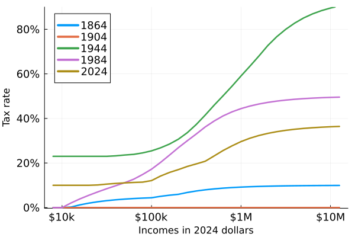

# US Income tax plots

Using data from [taxfoundation.org](https://taxfoundation.org/data/all/federal/historical-income-tax-rates-brackets/), 
here are a few plots of US income taxes. These do not include the full tax treatment as
[Taxsim](https://www.nber.org/research/data/taxsim) does; the plots below show solely the effective
income tax from the base tax brackets (e.g. without any sort of deductions).
The first figure shows an animation of US income tax from 1862 to 2024,
with all incomes converted into 2024 dollars using
[CPI](https://www.minneapolisfed.org/about-us/monetary-policy/inflation-calculator/consumer-price-index-1800-)
data from the Minneapolis Fed. There's lotsa history going on in this graph!

Here's a bit more focused figure showing the brackets in 40-year increments from 1864 to 2024.
We see the low tax in the 1860s, no income tax of 1904, the high wartime tax of 1944, 
the tax in the middle of the Reagan years (before his final tax cuts), 
and finally the rates for tax year 2024.

One interesting thing is the number of tax brackets. Originally there were only a small 
number of brackets, but in 1918 through 1921 there were 56 income tax brackets.

