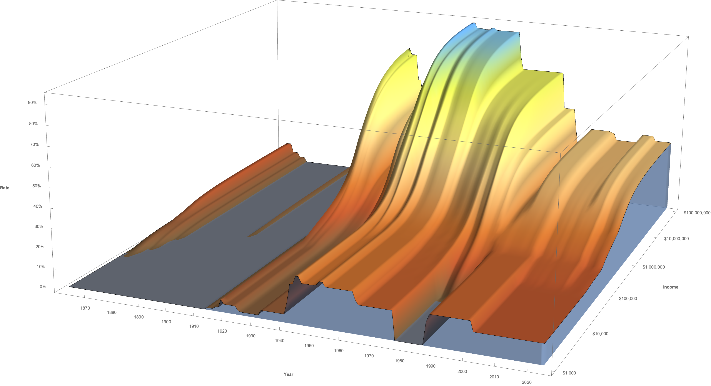
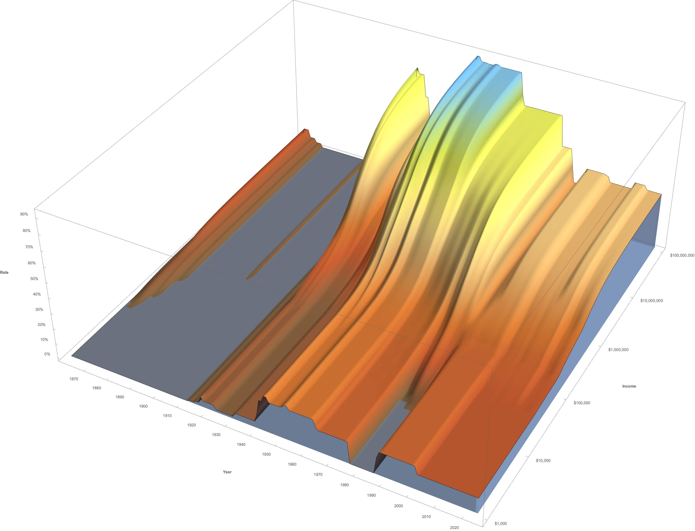

# US Income Tax Surfaces

The following are graphs of "surfaces" showing the full history of US income tax schedules
for households "married, filing jointly". Dollars amounts are 2024 dollars, CPI adjusted.
Rates are effective tax rates before any deductions, credits, etc.

For more information, please read [here](../README.md).

You can also [play with this surface interactively](https://www.wolframcloud.com/obj/d784e30e-ba8d-477b-abf3-1948cd23ce84).

---

### Frontal

---

### From above

